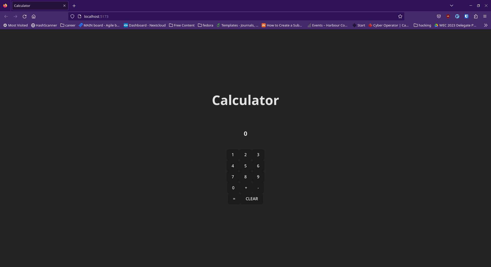

# React + TypeScript + Vite



This project creates a very basic client-side js-powered calculator app.

This illustrates the basics of react/typescript development including:

1. React hooks (useState() in this example)
2. React Functional Components (Button.ts in this example)


## Running the Project
run the command:
```bash
npm run dev
```
to start the development server.

Alternatively, if you want to use docker for development, 
use 
```bash
docker compose up --build
```
to start the development server. 

